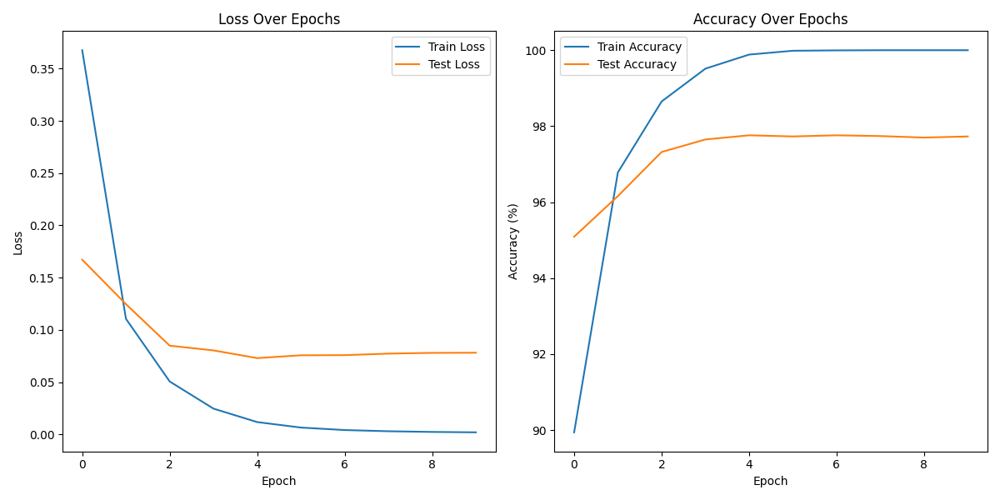

# kan-rbf

This repository is a straightforward port of [FastKAN](https://github.com/ZiyaoLi/fast-kan/tree/master), replacing the B-spline in [KAN](https://github.com/KindXiaoming/pykan) with a Radial Basis Function (RBF). The implementation is written in [Flax NNX](https://flax-nnx.readthedocs.io/en/latest/mnist_tutorial.html).

For comparison, [efficient-kan](https://github.com/Blealtan/efficient-kan) is also included, providing an efficient implementation for benchmarking against RBF-based approach.

### Key Files:
- **Core Implementation:** `kanrbf.py`
- **Test for Correctness:** `test_kanrbf.py`
- **Latency Benchmark:** `test_running_time.ipynb`
- **MNIST Training Example:** `train_mnist.py`

### MNIST Training Performance:

###

If you find any bugs or issues, please report them.
